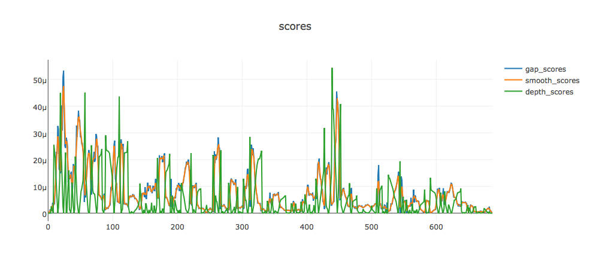
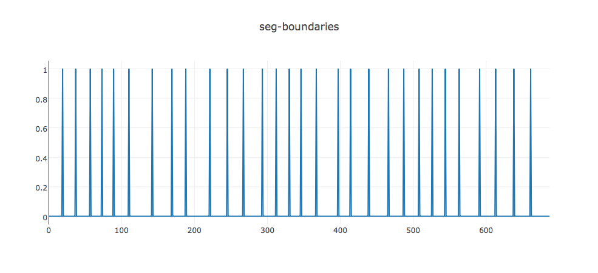

# Texttiling with LDA for Topic Detection
> This project is used to find the topics in a meeting text scripts.

* Copyright (C) 2016-2017 NCKUIIM Project
* Author: Tai-Chia Huang
* Email: vallwesture@gmail.com

# Description
### English Version
Goal: Find segmentations of the text to make user quickly understand what the article tells

This program improves the block comparison algorithm in Texttiling, by using LDA model(using Wikipedia Corpus)

### Chinese Version
目標：針對任一文件，找出文件的段落，常見的有的新聞分析、會議分析等等。透過切段落並找出該段落的關鍵字後，能讓使用者快速瞭解該文章的內容

本程式使用LDA Model來改善Texttiling的Block Comparison演算法。傳統上Block Comparison會遇到字不同時而無法比對的情況，採用LDA Model就能改善該情況


# Input
Sample.txt

# Output
Sample_Seg.txt

# Usage
```
jupyter notebook
# then open Texttiling with LDA for Topic Detetion.ipynb
```
# Know-how
1. LDA Model
2. NLTK: Natural Language Took Kit
3. Textting Algorithm

# Workflow
### 1. Train Corpus with LDA
1. Create wikipedia dictionary
2. Create wikipedia MmCorpus from step 1
3. Use LDA to train corpus, to find the topic most-associated with each word
4. Test: get topic similarity from topics

### 2. Texttiling Algorithm
1. Declaration: Tokenization
2. Declaration: Blokc Comparison and Lexical Score Determination
3. Declaration: Smoothing and Boundary identification
4. Run Demo

### 3. Given the segment, find the topic via LDA
1. use LDA to find most related topic
2. now we have the topic_id, let's find out which word has the highest prob related to that topic

# Result of Texttiling given LDA modeling

### Gap Score (with Smooth), Depth Score


### Boundaries


